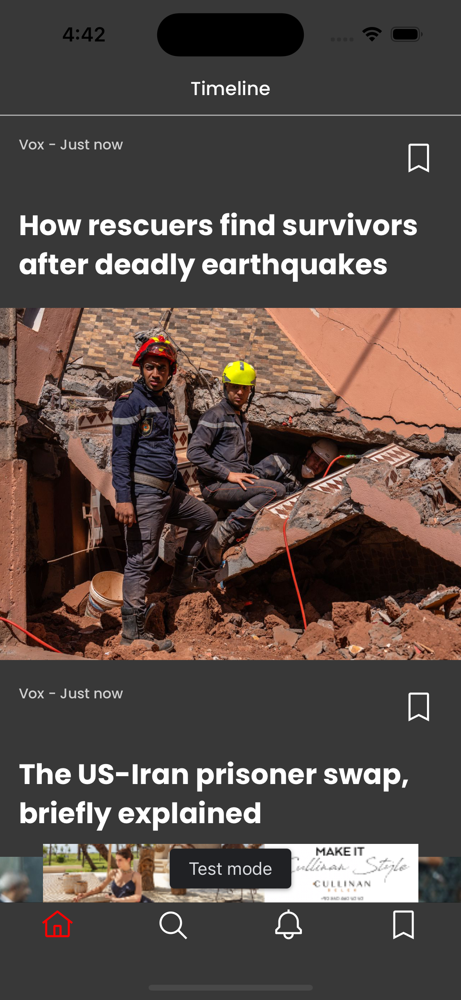
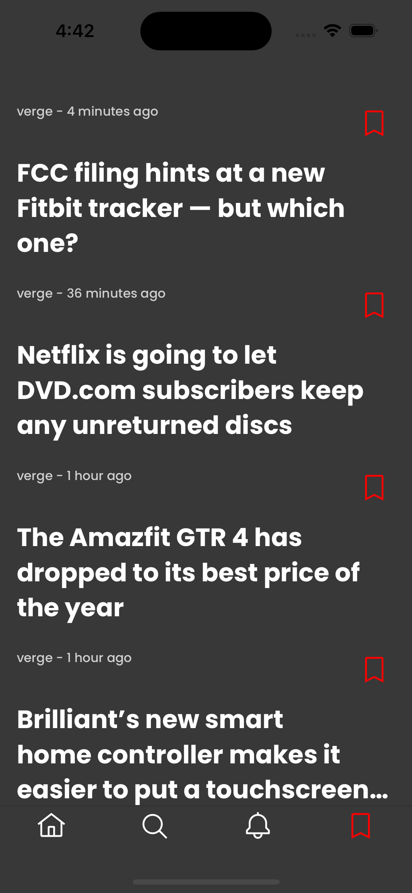
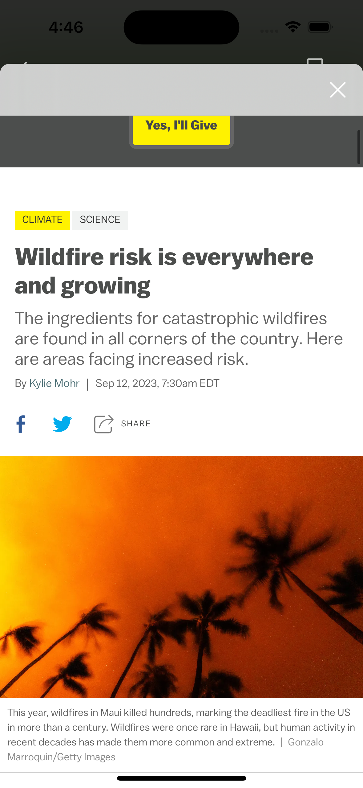

# News Feed App
-----------------------------------------------------

 
 
 
 

## Table of Contents
1. [Introduction](#introduction)
2. [Design](#design)
3. [Required Functionality](#required-functionality)
4. [Technology Stack](#technology-stack)
5. [Installation](#installation)
6. [Usage](#usage)
7. [Contributing](#contributing)
8. [License](#license)

## Introduction

The News Feed App is a mobile application that allows users to access news feeds from different sources and combines them into one unified feed, sorted by the date and time of publication. This app provides a seamless reading experience with the ability to view full articles using a built-in WebView, even in offline mode.

## Design

The app's design was created using Figma and can be viewed [here](https://www.figma.com/file/FcG9PHZeuXSybSOHlUjNJD/News-feed). It features a clean and user-friendly interface, with distinct list item designs for each news source.

## Required Functionality

### Key Features
- Display news feeds from different sources in a unified feed.
- Each news source has a separate list item design.
- View full articles by clicking on a list item (simple WebView).
- Offline mode: Store news in cache and display cached news when there is no internet connection.
- If there is no cached data, display a blank screen in offline mode.
- Notify the user when the internet connection is restored and allow them to update the news feed.
- Implement pull-to-refresh functionality for updating news.
- Display banner ads at the bottom of the news feed list screen using Google Ads.
- Show interstitial ads every two times a news article is opened.

## Technology Stack

The app is built using the following technology stack and third-party libraries:

- Swift
- UIKit for the user interface
- Auto Layout for responsive layout design
- Core Data for news data storage and caching
- Alamofire for network requests
- Codable for parsing news data
- Google Ads for displaying banner and interstitial ads
- MVC (Model-View-Controller) architectural pattern
- Third-party SDK for ad integration
- Cocoapods for managing third-party dependencies

## Installation

To install and run the News Feed App on your iOS device or simulator (iOS 12 or later), follow these steps:

1. Clone this repository.
2. Open the project in Xcode.
3. Build and run the app on your device or simulator.

## Usage

1. Launch the app.
2. Explore the unified news feed from different sources.
3. Click on a news article to view the full article in a WebView.
4. Use the app in offline mode if there is no internet connection. Cached news will be available.
5. When the internet connection is restored, the app will notify you and offer the option to update the news feed.
6. Pull down to refresh the news feed and fetch the latest articles.
7. Banner ads will be displayed at the bottom of the news feed list screen.
8. Interstitial ads will appear every two times you open a news article.

## Contributing

Contributions to this project are welcome. If you would like to contribute, please follow these guidelines:

1. Fork the repository.
2. Create a new branch for your feature or bug fix.
3. Make your changes and test thoroughly.
4. Create a pull request, explaining your changes and providing details on how to test them.

## License

This project is licensed under the [MIT License](LICENSE).

Feel free to reach out to the project maintainers for any questions or feedback. Thank you for using the News Feed App!
